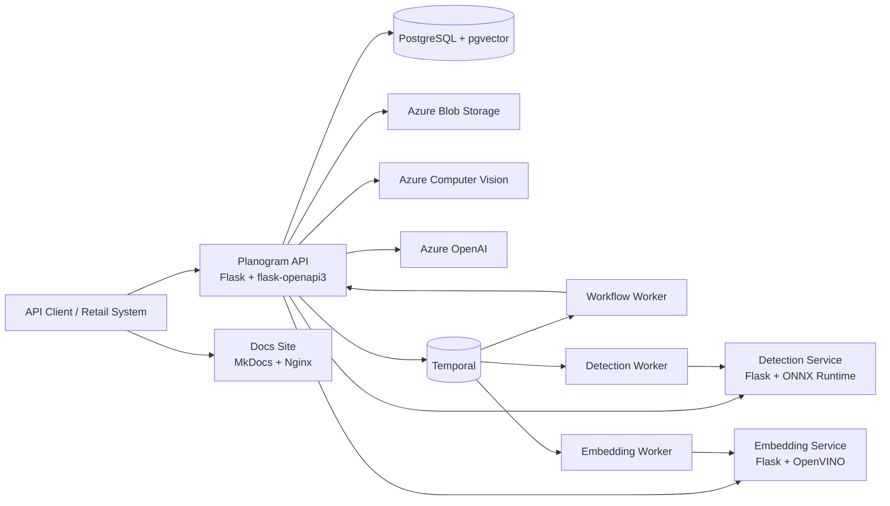
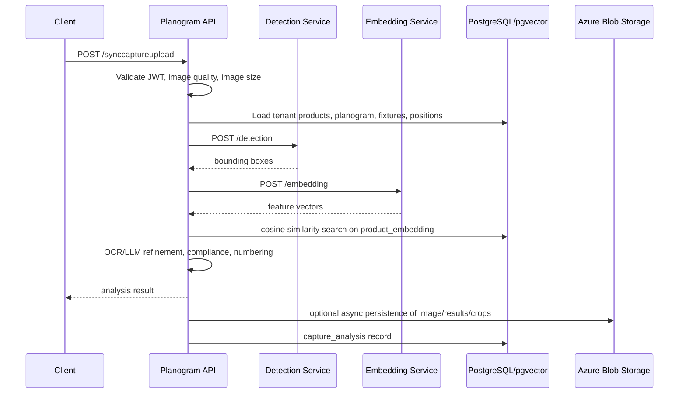
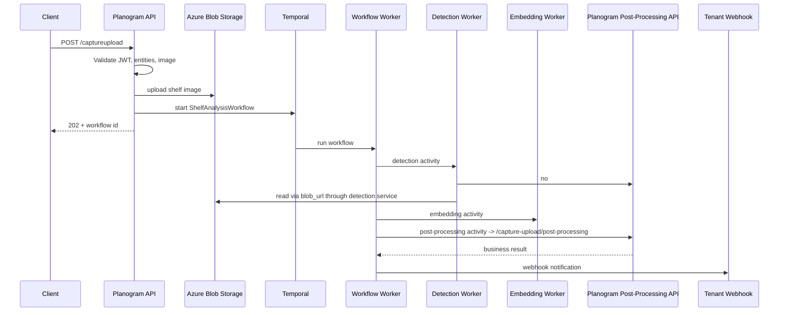
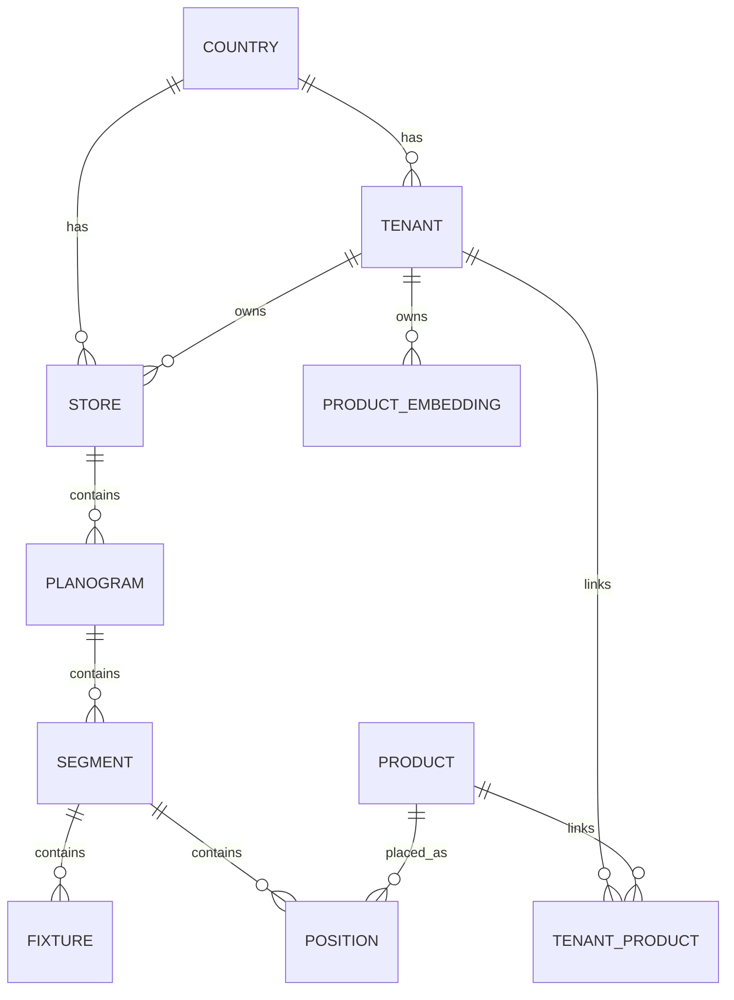

**Executive Summary**

This repository implements an API-first “Intelligent Shelf Analyzer” platform for retail shelf operations. The main business flow is:

1. Create a tenant/retailer.
2. Register products and reference product images.
3. Register planogram layouts, either as JSON or from PSA files.
4. Submit shelf images for analysis.
5. Retrieve structured product-placement, compliance, price, and capture-analysis results.

That purpose is stated in the public docs and is reflected directly in the code paths for tenant, product, planogram, capture-upload, price-upload, and analysis retrieval APIs in [README.md](/home/panasonic/Planogram_Service-final-migration/README.md), [docs/public/index.md](/home/panasonic/Planogram_Service-final-migration/docs/public/index.md), [planogram/src/api.py](/home/panasonic/Planogram_Service-final-migration/planogram/src/api.py), and the route modules under [planogram/src](/home/panasonic/Planogram_Service-final-migration/planogram/src).

What problem it solves:
- It turns shelf photos into structured operational data.
- It compares actual shelf state against expected shelf state.
- It extracts price-tag information from shelf images.
- It supports automated planogram generation from shelf photos.

Target users:
- The code and docs consistently use `tenant`, `retailer`, `product`, `planogram`, `capture`, and `webhook_url`, which indicates B2B customers such as retailers and shelf-operations teams rather than consumers. This is visible in [planogram/src/tenant/routes.py](/home/panasonic/Planogram_Service-final-migration/planogram/src/tenant/routes.py), [planogram/src/product/routes.py](/home/panasonic/Planogram_Service-final-migration/planogram/src/product/routes.py), and [docs/public/getting-started.md](/home/panasonic/Planogram_Service-final-migration/docs/public/getting-started.md).

Core business value:
- Product-catalog onboarding and searchable visual index.
- Shelf compliance analysis against planograms.
- Price-tag extraction workflow.
- Capture-result persistence and retrieval.
- Webhook-driven automation for asynchronous workflows.
- Auto-generation of planograms from real shelf imagery.

Major capabilities:
- OAuth client authentication with JWT issuance.
- Tenant creation with automatic store creation.
- Product upsert and tenant-product association.
- Product image registration with embedding generation and rotated variants.
- Similar-product search by product ID or image.
- Planogram registration from JSON and PSA.
- Synchronous shelf analysis.
- Asynchronous shelf analysis via Temporal workflows.
- Price-capture OCR pipeline.
- Capture-analysis retrieval, cropped-image retrieval, and alternative-product retrieval.
- Admin-style vector-point inspection.
- Static documentation site with public and internal variants.

Overall system purpose:
- This is a multi-service retail computer-vision platform centered on the `planogram` API, supported by dedicated inference services (`embedding`, `detection`), and a Temporal-based orchestration layer for asynchronous shelf-analysis execution. That structure is visible in [DEVELOPMENT.md](/home/panasonic/Planogram_Service-final-migration/DEVELOPMENT.md), [planogram/src/capture_upload/routes.py](/home/panasonic/Planogram_Service-final-migration/planogram/src/capture_upload/routes.py#L38), [orchestration/capture_upload/workflows/main/shelf_analysis_workflow.py](/home/panasonic/Planogram_Service-final-migration/orchestration/capture_upload/workflows/main/shelf_analysis_workflow.py#L106), and the Kubernetes manifests under [manifest/staging-primary](/home/panasonic/Planogram_Service-final-migration/manifest/staging-primary).

**Product Capability Analysis**

| Capability | Purpose | How it works | Components | Evidence |
|---|---|---|---|---|
| OAuth client auth + JWT | Secure API access | `/api/v1/auth/token` validates client credentials against `oauth_client`, then issues HS256 JWTs | `planogram` auth routes/services/models | [planogram/src/auth/routes.py](/home/panasonic/Planogram_Service-final-migration/planogram/src/auth/routes.py#L26), [planogram/src/auth/services.py](/home/panasonic/Planogram_Service-final-migration/planogram/src/auth/services.py), [planogram/src/auth/jwt.py](/home/panasonic/Planogram_Service-final-migration/planogram/src/auth/jwt.py#L12), [planogram/src/models/oauth_client.py](/home/panasonic/Planogram_Service-final-migration/planogram/src/models/oauth_client.py) |
| Tenant onboarding | Create retailer entities | `POST /tenants` creates a tenant and auto-creates a default store | tenant/country/store services and models | [planogram/src/tenant/routes.py](/home/panasonic/Planogram_Service-final-migration/planogram/src/tenant/routes.py), [planogram/src/tenant/services.py](/home/panasonic/Planogram_Service-final-migration/planogram/src/tenant/services.py), [planogram/src/models/tenant.py](/home/panasonic/Planogram_Service-final-migration/planogram/src/models/tenant.py), [planogram/src/models/store.py](/home/panasonic/Planogram_Service-final-migration/planogram/src/models/store.py) |
| Tenant maintenance | Update retailer metadata and list linked products | `PATCH /tenants/<id>` updates fields; `GET /tenants/<id>/products` lists associated catalog entries | tenant routes/services/repository | [planogram/src/tenant/routes.py](/home/panasonic/Planogram_Service-final-migration/planogram/src/tenant/routes.py) |
| Product catalog upsert | Load or update product master data | Product upsert splits incoming products into insert/update/link-only paths using `product` and `tenant_product` tables | product service/repository/models | [planogram/src/product/routes.py](/home/panasonic/Planogram_Service-final-migration/planogram/src/product/routes.py#L39), [planogram/src/product/services.py](/home/panasonic/Planogram_Service-final-migration/planogram/src/product/services.py), [planogram/src/product/repository.py](/home/panasonic/Planogram_Service-final-migration/planogram/src/product/repository.py), [planogram/src/models/product.py](/home/panasonic/Planogram_Service-final-migration/planogram/src/models/product.py), [planogram/src/models/tenant_product.py](/home/panasonic/Planogram_Service-final-migration/planogram/src/models/tenant_product.py) |
| Product image registration | Build the searchable visual product index | Registers original image plus configured rotated variants; each image is embedded and stored as a `product_embedding` row | product service + embedding service + pgvector model | [planogram/src/product/services.py](/home/panasonic/Planogram_Service-final-migration/planogram/src/product/services.py#L308), [planogram/src/vector_db/services.py](/home/panasonic/Planogram_Service-final-migration/planogram/src/vector_db/services.py#L32), [planogram/src/models/product_embedding.py](/home/panasonic/Planogram_Service-final-migration/planogram/src/models/product_embedding.py#L17), [embedding/src/feature_extractor/routes.py](/home/panasonic/Planogram_Service-final-migration/embedding/src/feature_extractor/routes.py) |
| Similar-product search | Search by product ID or by uploaded image | For product ID, retrieves an existing embedding and runs cosine similarity search; for image, first calls embedding service then searches | product service + embedding service + `product_embedding` table | [planogram/src/product/routes.py](/home/panasonic/Planogram_Service-final-migration/planogram/src/product/routes.py#L73), [planogram/src/product/services.py](/home/panasonic/Planogram_Service-final-migration/planogram/src/product/services.py#L389), [planogram/src/product/repository.py](/home/panasonic/Planogram_Service-final-migration/planogram/src/product/repository.py#L98) |
| Planogram registration by JSON | Store expected shelf layout | Writes planogram, segment, fixture, and position hierarchy; also handles fixture type `11` special processing | planogram/segment/fixture/position services and helpers | [planogram/src/planogram/routes.py](/home/panasonic/Planogram_Service-final-migration/planogram/src/planogram/routes.py#L32), [planogram/src/planogram/services.py](/home/panasonic/Planogram_Service-final-migration/planogram/src/planogram/services.py#L38) |
| Planogram registration by PSA | Import PSA shelf-layout files | Parses PSA, validates planogram/product/segment/fixture/position data, then upserts the same core hierarchy | planogram PSA parser/validation/service | [planogram/src/planogram/routes.py](/home/panasonic/Planogram_Service-final-migration/planogram/src/planogram/routes.py#L48), [planogram/src/planogram/services.py](/home/panasonic/Planogram_Service-final-migration/planogram/src/planogram/services.py#L151), [planogram/src/planogram/psa](/home/panasonic/Planogram_Service-final-migration/planogram/src/planogram/psa) |
| Planogram retrieval | Return the stored expected layout | Reads planogram, segments, fixtures, positions for a planogram ID | planogram + dependent services | [planogram/src/planogram/routes.py](/home/panasonic/Planogram_Service-final-migration/planogram/src/planogram/routes.py#L79), [planogram/src/planogram/services.py](/home/panasonic/Planogram_Service-final-migration/planogram/src/planogram/services.py#L114) |
| Synchronous shelf analysis | Immediate product analysis result | Detection -> embedding similarity search -> post-processing -> optional blob persistence | `planogram` service pipeline | [planogram/src/capture_upload/routes.py](/home/panasonic/Planogram_Service-final-migration/planogram/src/capture_upload/routes.py#L38), [planogram/src/capture_upload/services.py](/home/panasonic/Planogram_Service-final-migration/planogram/src/capture_upload/services.py), [planogram/src/capture_upload/pipelines/builders.py](/home/panasonic/Planogram_Service-final-migration/planogram/src/capture_upload/pipelines/builders.py) |
| Asynchronous shelf analysis | Webhook-driven non-blocking analysis | Uploads shelf image to blob, starts Temporal workflow, workers call detection/embedding/post-processing, then webhook sends result | planogram Temporal client + orchestration workflow + workers | [planogram/src/capture_upload/routes.py](/home/panasonic/Planogram_Service-final-migration/planogram/src/capture_upload/routes.py#L57), [planogram/src/capture_upload/services.py](/home/panasonic/Planogram_Service-final-migration/planogram/src/capture_upload/services.py#L424), [planogram/src/capture_upload/temporal_client.py](/home/panasonic/Planogram_Service-final-migration/planogram/src/capture_upload/temporal_client.py), [orchestration/capture_upload/workflows/main/shelf_analysis_workflow.py](/home/panasonic/Planogram_Service-final-migration/orchestration/capture_upload/workflows/main/shelf_analysis_workflow.py#L106) |
| Post-processing API | Worker-facing semantic conversion | Converts raw detection boxes + embeddings into shelf/business results, including compliance and alternatives | post-processing route/service/repository | [planogram/src/capture_upload/routes.py](/home/panasonic/Planogram_Service-final-migration/planogram/src/capture_upload/routes.py#L72), [planogram/src/capture_upload/post_processing_service.py](/home/panasonic/Planogram_Service-final-migration/planogram/src/capture_upload/post_processing_service.py) |
| Price capture analysis | OCR-driven price-tag extraction | Uses Azure Vision OCR pipeline, price parsing, coordinate post-processing, optional async webhook callback | price routes/services/pipeline steps | [planogram/src/capture_upload_price/routes.py](/home/panasonic/Planogram_Service-final-migration/planogram/src/capture_upload_price/routes.py), [planogram/src/capture_upload_price/services.py](/home/panasonic/Planogram_Service-final-migration/planogram/src/capture_upload_price/services.py), [planogram/src/capture_upload_price/pipelines/steps/processing/azure_ocr_extraction_step.py](/home/panasonic/Planogram_Service-final-migration/planogram/src/capture_upload_price/pipelines/steps/processing/azure_ocr_extraction_step.py), [planogram/src/capture_upload_price/pipelines/steps/processing/extract_price_step.py](/home/panasonic/Planogram_Service-final-migration/planogram/src/capture_upload_price/pipelines/steps/processing/extract_price_step.py) |
| Capture-analysis retrieval | Retrieve persisted analysis results | Reads capture-analysis metadata from DB and downloads result/image blobs | capture-analysis routes/services + Azure blob helper | [planogram/src/capture_analysis/routes.py](/home/panasonic/Planogram_Service-final-migration/planogram/src/capture_analysis/routes.py), [planogram/src/capture_analysis/services.py](/home/panasonic/Planogram_Service-final-migration/planogram/src/capture_analysis/services.py) |
| Cropped product-image retrieval | Access crops from a previous capture | Lists or retrieves per-product crop images from blob storage | capture-analysis routes + analysis blob helper | [planogram/src/capture_analysis/routes.py](/home/panasonic/Planogram_Service-final-migration/planogram/src/capture_analysis/routes.py#L86) |
| Alternative product retrieval | Explain near matches | Downloads stored alternative-product JSON for a capture and filters it per selected product | product service + capture-analysis record + blob | [planogram/src/product/routes.py](/home/panasonic/Planogram_Service-final-migration/planogram/src/product/routes.py#L88), [planogram/src/product/services.py](/home/panasonic/Planogram_Service-final-migration/planogram/src/product/services.py#L242) |
| Vector inspection | Internal/admin inspection of stored embeddings | Returns payloads and optionally vectors from `product_embedding` rows | point route/service/repository | [planogram/src/point/routes.py](/home/panasonic/Planogram_Service-final-migration/planogram/src/point/routes.py), [planogram/src/point/services.py](/home/panasonic/Planogram_Service-final-migration/planogram/src/point/services.py), [planogram/src/point/repository.py](/home/panasonic/Planogram_Service-final-migration/planogram/src/point/repository.py) |
| Automatic planogram generation | Convert shelf image to PSA | Marker detection, perspective warp, fixture estimation, PSA generation pipeline | planogram-generator routes/services/pipeline/utils | [planogram/src/planogram_generator/routes.py](/home/panasonic/Planogram_Service-final-migration/planogram/src/planogram_generator/routes.py), [planogram/src/planogram_generator/services.py](/home/panasonic/Planogram_Service-final-migration/planogram/src/planogram_generator/services.py), [planogram/src/planogram_generator/pipelines/builders.py](/home/panasonic/Planogram_Service-final-migration/planogram/src/planogram_generator/pipelines/builders.py) |
| AI-assisted OCR/LLM refinement | Improve recognition beyond image similarity | OCR text is embedded and combined with image similarity; unknowns can go through LLM-based product-name extraction and fuzzy matching | recogs-processing + refine-unknown + Azure OpenAI + Azure Vision | [planogram/src/capture_upload/pipelines/steps/postprocessing/recogs_processing_step.py](/home/panasonic/Planogram_Service-final-migration/planogram/src/capture_upload/pipelines/steps/postprocessing/recogs_processing_step.py), [planogram/src/capture_upload/pipelines/steps/postprocessing/refine_unknown_item_step.py](/home/panasonic/Planogram_Service-final-migration/planogram/src/capture_upload/pipelines/steps/postprocessing/refine_unknown_item_step.py), [planogram/src/kit/product_info_embedder.py](/home/panasonic/Planogram_Service-final-migration/planogram/src/kit/product_info_embedder.py), [planogram/src/kit/product_info_extractor.py](/home/panasonic/Planogram_Service-final-migration/planogram/src/kit/product_info_extractor.py) |
| Documentation delivery | Public/internal docs and interactive API references | MkDocs builds two sites, served by Nginx, with public/internal routes separated in deployment | docs Dockerfile, MkDocs configs, manifests | [docs/Dockerfile](/home/panasonic/Planogram_Service-final-migration/docs/Dockerfile), [docs/mkdocs-public.yml](/home/panasonic/Planogram_Service-final-migration/docs/mkdocs-public.yml), [docs/mkdocs-internal.yml](/home/panasonic/Planogram_Service-final-migration/docs/mkdocs-internal.yml), [manifest/staging-primary/documentation.yaml](/home/panasonic/Planogram_Service-final-migration/manifest/staging-primary/documentation.yaml) |

**Complete Architecture Analysis**

**High-Level Architecture**

Current architecture from code:
- `planogram` is the central API and business layer.
- `embedding` is a focused inference microservice for vector generation.
- `detection` is a focused inference microservice for bounding-box detection.
- `orchestration` contains Temporal workflows and worker processes for asynchronous shelf analysis.
- `docs` is a separate static documentation deployment.

Evidence:
- [planogram/src/__init__.py](/home/panasonic/Planogram_Service-final-migration/planogram/src/__init__.py)
- [embedding/src/__init__.py](/home/panasonic/Planogram_Service-final-migration/embedding/src/__init__.py)
- [detection/app.py](/home/panasonic/Planogram_Service-final-migration/detection/app.py)
- [orchestration/capture_upload/workflows/main/shelf_analysis_workflow.py](/home/panasonic/Planogram_Service-final-migration/orchestration/capture_upload/workflows/main/shelf_analysis_workflow.py)
- [docs/Dockerfile](/home/panasonic/Planogram_Service-final-migration/docs/Dockerfile)

**Frontend Architecture**

There is no customer-facing web frontend application in this repository. The only frontend-like surface is the documentation site:
- MkDocs builds `public` and `internal` static sites.
- Nginx serves them on separate ports.
- Kubernetes exposes them behind path-based routes.
- Internal docs are additionally protected by a custom authorization policy.

Evidence:
- [docs/Dockerfile](/home/panasonic/Planogram_Service-final-migration/docs/Dockerfile)
- [manifest/staging-primary/documentation.yaml](/home/panasonic/Planogram_Service-final-migration/manifest/staging-primary/documentation.yaml)
- [manifest/develop/authorization-policy.yaml](/home/panasonic/Planogram_Service-final-migration/manifest/develop/authorization-policy.yaml)
- [manifest/staging-primary/httproute.yaml](/home/panasonic/Planogram_Service-final-migration/manifest/staging-primary/httproute.yaml)

**Backend Architecture**

The backend is split by responsibility.

`planogram`:
- Owns authentication, domain validation, persistence, business workflows, Azure integration, and synchronous capture analysis.
- Also acts as the semantic post-processing service used by Temporal workers.

`embedding`:
- Loads an OpenVINO model either from local files or Azure Blob Storage.
- Exposes `/embedding` and `/embedding/url`.
- Normalizes embeddings after inference.

`detection`:
- Legacy-style Flask service centered on `app.py`.
- Loads ONNX detection model from local or Azure-backed storage.
- Exposes `/detection` and `/detection/url`.

`orchestration`:
- Uses Temporal for asynchronous shelf analysis.
- Runs detection, embedding, post-processing, and notification as activity boundaries.
- Keeps worker deployments separate from the main API deployment.

**Request Lifecycle**

Synchronous product-capture path:

Asynchronous product-capture path:

Evidence:
- [planogram/src/capture_upload/routes.py](/home/panasonic/Planogram_Service-final-migration/planogram/src/capture_upload/routes.py#L38)
- [planogram/src/capture_upload/services.py](/home/panasonic/Planogram_Service-final-migration/planogram/src/capture_upload/services.py#L424)
- [orchestration/capture_upload/workflows/main/shelf_analysis_workflow.py](/home/panasonic/Planogram_Service-final-migration/orchestration/capture_upload/workflows/main/shelf_analysis_workflow.py#L111)

**Authentication and Authorization Flow**

API auth flow:
1. Client posts `clientId` and `clientSecret` to `/api/v1/auth/token`.
2. `OAuthClientService.verify` checks the hashed secret in `oauth_client`.
3. `generate_jwt_token` creates an HS256 JWT with `client_id`, `scopes`, and `exp`.
4. `require_jwt` validates Bearer token on protected routes and stores claims in `flask.g`.

Evidence:
- [planogram/src/auth/routes.py](/home/panasonic/Planogram_Service-final-migration/planogram/src/auth/routes.py#L26)
- [planogram/src/auth/services.py](/home/panasonic/Planogram_Service-final-migration/planogram/src/auth/services.py)
- [planogram/src/auth/jwt.py](/home/panasonic/Planogram_Service-final-migration/planogram/src/auth/jwt.py#L12)

Authorization model:
- Route protection is binary: protected vs unprotected.
- The repo stores `scopes` on OAuth clients and embeds `scopes` in JWTs, but no route-level scope checks are implemented in `require_jwt`.
- Internal docs are protected separately at ingress by `oauth2-proxy` via Istio `AuthorizationPolicy`.

Evidence:
- [planogram/src/models/oauth_client.py](/home/panasonic/Planogram_Service-final-migration/planogram/src/models/oauth_client.py)
- [planogram/src/auth/jwt.py](/home/panasonic/Planogram_Service-final-migration/planogram/src/auth/jwt.py#L17)
- [manifest/develop/authorization-policy.yaml](/home/panasonic/Planogram_Service-final-migration/manifest/develop/authorization-policy.yaml)

**Database Architecture**

Current data architecture is PostgreSQL-centered, with `pgvector` extension enabled by [init-db.sql](/home/panasonic/Planogram_Service-final-migration/init-db.sql).

Core relational entities:
- `country`
- `tenant`
- `store`
- `product`
- `tenant_product`
- `planogram`
- `segment`
- `fixture`
- `position`
- `capture_analysis`
- `oauth_client`
- `product_embedding`

Vector storage:
- Product vectors are stored in `product_embedding.embedding` as `Vector(256)`.
- OCR/text vectors are stored in `product_embedding.product_info_vector`.
- Similarity queries use `cosine_distance` through SQLAlchemy/pgvector.

Evidence:
- [planogram/src/models/product_embedding.py](/home/panasonic/Planogram_Service-final-migration/planogram/src/models/product_embedding.py#L17)
- [planogram/src/vector_db/services.py](/home/panasonic/Planogram_Service-final-migration/planogram/src/vector_db/services.py#L18)
- [planogram/src/product/repository.py](/home/panasonic/Planogram_Service-final-migration/planogram/src/product/repository.py#L98)
- [planogram/migrations/versions/2026-01-26-1036_add_product_embedding_table.py](/home/panasonic/Planogram_Service-final-migration/planogram/migrations/versions/2026-01-26-1036_add_product_embedding_table.py)

**Infrastructure Architecture**

From manifests, the runtime architecture includes:
- Kubernetes Deployments for `planogram`, `embedding`, `detection`, and docs.
- Separate worker Deployments for Temporal activity and workflow workers.
- `ClusterIP` Services for internal service-to-service traffic.
- `HTTPRoute` path routing for public exposure.
- `AuthorizationPolicy` for internal docs auth.
- KEDA `ScaledObject`s for queue- and resource-based scaling.
- Azure Workload Identity labels and Key Vault CSI secret mounts.
- DB migrations as an initContainer in `planogram`.

Evidence:
- [manifest/staging-primary/planogram.yaml](/home/panasonic/Planogram_Service-final-migration/manifest/staging-primary/planogram.yaml#L1)
- [manifest/staging-primary/orchestration-worker.yaml](/home/panasonic/Planogram_Service-final-migration/manifest/staging-primary/orchestration-worker.yaml)
- [manifest/staging-primary/embedding.yaml](/home/panasonic/Planogram_Service-final-migration/manifest/staging-primary/embedding.yaml)
- [manifest/staging-primary/detection.yaml](/home/panasonic/Planogram_Service-final-migration/manifest/staging-primary/detection.yaml)
- [manifest/staging-primary/httproute.yaml](/home/panasonic/Planogram_Service-final-migration/manifest/staging-primary/httproute.yaml)
- [manifest/staging-primary/secretprovider.yaml](/home/panasonic/Planogram_Service-final-migration/manifest/staging-primary/secretprovider.yaml)

**Deployment Architecture**

The repo supports:
- Local development via Docker Compose for PostgreSQL with `pgvector`.
- Containerized deployment for all services.
- GitHub Actions image build and push.
- GitOps-style deployment updates into a separate `planogramDeployment` repository.
- Environment-specific promotion for dev, UAT, prod.
- Docs as a separately deployed artifact.

Evidence:
- [docker-compose.yml](/home/panasonic/Planogram_Service-final-migration/docker-compose.yml)
- [planogram/Dockerfile](/home/panasonic/Planogram_Service-final-migration/planogram/Dockerfile)
- [embedding/Dockerfile](/home/panasonic/Planogram_Service-final-migration/embedding/Dockerfile)
- [detection/Dockerfile](/home/panasonic/Planogram_Service-final-migration/detection/Dockerfile)
- [orchestration/Dockerfile](/home/panasonic/Planogram_Service-final-migration/orchestration/Dockerfile)
- [.github/workflows/build-and-push-planogram.yml](/home/panasonic/Planogram_Service-final-migration/.github/workflows/build-and-push-planogram.yml)
- [.github/workflows/build-and-push-documentation.yml](/home/panasonic/Planogram_Service-final-migration/.github/workflows/build-and-push-documentation.yml)

**Repository & Module Breakdown**

Top-level structure:

| Directory | Responsibility |
|---|---|
| `planogram/` | Main API, database models, business logic, capture workflows |
| `embedding/` | Image embedding inference API |
| `detection/` | Object detection inference API |
| `orchestration/` | Temporal workflows, activities, workers |
| `docs/` | Public/internal documentation sources and docs tooling |
| `manifest/` | Kubernetes manifests for develop and staging-primary |
| `.github/workflows/` | CI, build, deploy, security, docs, E2E |
| `assets/` | Static image assets used in docs/README |

Important `planogram/src` packages:

| Package | Responsibility |
|---|---|
| `auth` | OAuth client auth, JWT generation/validation |
| `tenant`, `store`, `country` | Retailer and location domain |
| `product` | Product onboarding, image registration, search, alternatives |
| `planogram`, `segment`, `fixture`, `position` | Shelf-layout domain |
| `capture_upload` | Product shelf-analysis flow |
| `capture_upload_price` | OCR-based price analysis flow |
| `capture_analysis` | Retrieval of stored capture results and crops |
| `planogram_generator` | Image-to-PSA generation |
| `point` | Vector inspection endpoint |
| `models` | SQLAlchemy schema |
| `kit` | Shared pipeline base classes, prompts, utility AI helpers |
| `vector_db` | Product embedding registration and similarity search |

Important `embedding/src` packages:
- `feature_extractor`: route, schema, preprocessing, embedding extraction.
- `inference`: model loading and inference session lifecycle.
- `health`, `logger`, `otel_setup`: operational support.

Important `orchestration/capture_upload` packages:
- `activities`: Temporal activity wrappers for detection, embedding, post-processing, notification.
- `services`: HTTP clients for downstream services.
- `workflows/main`: shelf-analysis workflow definition.
- `workers`: startup processes that register workers on task queues.

Important `detection/modules` packages:
- `rObjectDetectionInfLibPython`: legacy model/inference library.
- `blob_storage_mng`, `ex_object_detect`, `utils`: model loading and detection support.
- `parse_jwt_mng`, `environ_mng`, `log_print`: legacy support utilities.

Internal dependencies:
- `planogram` depends on `embedding` and `detection` over HTTP.
- `orchestration` depends on `planogram`, `embedding`, and `detection` over HTTP.
- `planogram` persists both relational and vector-like data in PostgreSQL through SQLAlchemy + pgvector.
- `embedding` and `detection` are intentionally stateless apart from in-memory models and blob access.

**Technology Stack Analysis**

| Technology | Role in system | Evidence |
|---|---|---|
| Python 3.10 / 3.12 | Primary implementation language | [planogram/pyproject.toml](/home/panasonic/Planogram_Service-final-migration/planogram/pyproject.toml), [orchestration/pyproject.toml](/home/panasonic/Planogram_Service-final-migration/orchestration/pyproject.toml) |
| Flask | Core web framework for `planogram`, `embedding`, `detection` | [planogram/pyproject.toml](/home/panasonic/Planogram_Service-final-migration/planogram/pyproject.toml), [embedding/pyproject.toml](/home/panasonic/Planogram_Service-final-migration/embedding/pyproject.toml), [detection/app.py](/home/panasonic/Planogram_Service-final-migration/detection/app.py) |
| flask-openapi3 | OpenAPI-driven request/response layer | [planogram/src/__init__.py](/home/panasonic/Planogram_Service-final-migration/planogram/src/__init__.py), [embedding/src/__init__.py](/home/panasonic/Planogram_Service-final-migration/embedding/src/__init__.py) |
| SQLAlchemy + Flask-SQLAlchemy | ORM and DB access | [planogram/src/models/base.py](/home/panasonic/Planogram_Service-final-migration/planogram/src/models/base.py) |
| Alembic / Flask-Migrate | Schema migration management | [planogram/migrations](/home/panasonic/Planogram_Service-final-migration/planogram/migrations), [planogram/src/__init__.py](/home/panasonic/Planogram_Service-final-migration/planogram/src/__init__.py) |
| PostgreSQL | Primary relational DB | [planogram/src/config.py](/home/panasonic/Planogram_Service-final-migration/planogram/src/config.py), [manifest/staging-primary/planogram.yaml](/home/panasonic/Planogram_Service-final-migration/manifest/staging-primary/planogram.yaml#L43) |
| pgvector | Vector storage and cosine similarity in PostgreSQL | [init-db.sql](/home/panasonic/Planogram_Service-final-migration/init-db.sql), [planogram/src/models/product_embedding.py](/home/panasonic/Planogram_Service-final-migration/planogram/src/models/product_embedding.py#L31) |
| OpenVINO | Embedding inference runtime | [embedding/src/inference/services.py](/home/panasonic/Planogram_Service-final-migration/embedding/src/inference/services.py), [embedding/pyproject.toml](/home/panasonic/Planogram_Service-final-migration/embedding/pyproject.toml) |
| ONNX Runtime | Detection inference runtime | [detection/modules/ex_object_detect.py](/home/panasonic/Planogram_Service-final-migration/detection/modules/ex_object_detect.py), [detection/pyproject.toml](/home/panasonic/Planogram_Service-final-migration/detection/pyproject.toml) |
| OpenCV | Image processing throughout capture, OCR, and generation pipelines | present across `planogram`, `embedding`, `detection` |
| PyTorch | Tensor normalization / embedding tensor handling | [embedding/src/feature_extractor/services.py](/home/panasonic/Planogram_Service-final-migration/embedding/src/feature_extractor/services.py), [planogram/pyproject.toml](/home/panasonic/Planogram_Service-final-migration/planogram/pyproject.toml) |
| Azure Blob Storage SDK | Model download, shelf-image storage, result persistence | [embedding/src/inference/services.py](/home/panasonic/Planogram_Service-final-migration/embedding/src/inference/services.py), [planogram/src/capture_upload/utils/analysis_blob_storage.py](/home/panasonic/Planogram_Service-final-migration/planogram/src/capture_upload/utils/analysis_blob_storage.py), [detection/modules/blob_storage_mng.py](/home/panasonic/Planogram_Service-final-migration/detection/modules/blob_storage_mng.py) |
| Azure Identity | Managed identity / Entra auth | [planogram/src/config.py](/home/panasonic/Planogram_Service-final-migration/planogram/src/config.py), [embedding/src/inference/services.py](/home/panasonic/Planogram_Service-final-migration/embedding/src/inference/services.py) |
| Azure OpenAI | Text embedding and vision/LLM-assisted refinement | [planogram/src/kit/product_info_embedder.py](/home/panasonic/Planogram_Service-final-migration/planogram/src/kit/product_info_embedder.py), [planogram/src/kit/product_info_extractor.py](/home/panasonic/Planogram_Service-final-migration/planogram/src/kit/product_info_extractor.py) |
| Azure Computer Vision | OCR for price pipeline and OCR-assisted refinement | [planogram/src/capture_upload_price/pipelines/steps/processing/azure_ocr_extraction_step.py](/home/panasonic/Planogram_Service-final-migration/planogram/src/capture_upload_price/pipelines/steps/processing/azure_ocr_extraction_step.py) |
| Temporal | Asynchronous shelf-analysis workflow orchestration | [orchestration/pyproject.toml](/home/panasonic/Planogram_Service-final-migration/orchestration/pyproject.toml), [orchestration/capture_upload/workflows/main/shelf_analysis_workflow.py](/home/panasonic/Planogram_Service-final-migration/orchestration/capture_upload/workflows/main/shelf_analysis_workflow.py) |
| Gunicorn + gevent | Production process manager for Flask services | Dockerfiles for `planogram`, `embedding`, `detection` |
| MkDocs + Nginx | Static docs generation and serving | [docs/Dockerfile](/home/panasonic/Planogram_Service-final-migration/docs/Dockerfile) |
| Ruff | Linting and formatting | [ruff.toml](/home/panasonic/Planogram_Service-final-migration/ruff.toml), [.pre-commit-config.yaml](/home/panasonic/Planogram_Service-final-migration/.pre-commit-config.yaml) |
| Pytest | Unit/integration/system testing | test directories and workflow files |
| GitHub Actions | CI/CD orchestration | [.github/workflows](/home/panasonic/Planogram_Service-final-migration/.github/workflows) |
| CodeQL + Black Duck | Security and OSS-risk analysis | [codeql.yml](/home/panasonic/Planogram_Service-final-migration/.github/workflows/codeql.yml), Black Duck workflows |
| KEDA | Autoscaling based on Temporal queue + CPU/memory | manifests under `manifest/*/*.yaml` |
| Gateway API + Istio policy | Ingress routing and custom authz | [manifest/staging-primary/httproute.yaml](/home/panasonic/Planogram_Service-final-migration/manifest/staging-primary/httproute.yaml), [manifest/develop/authorization-policy.yaml](/home/panasonic/Planogram_Service-final-migration/manifest/develop/authorization-policy.yaml) |

**API & Integration Analysis**

**Planogram API endpoint inventory**

| Method | Path | Purpose | Auth |
|---|---|---|---|
| `POST` | `/api/v1/auth/token` | Get access token | No |
| `POST` | `/api/v1/productdata` | Upsert products | JWT |
| `POST` | `/api/v1/productimage` | Register product image | JWT |
| `POST` | `/api/v1/productsearch` | Search products | JWT |
| `GET` | `/api/v1/tenants/{tenant_id}/products/{product_id}/alternativeProducts` | Alternative products | JWT |
| `POST` | `/api/v1/tenants` | Create tenant | JWT |
| `PATCH` | `/api/v1/tenants/{id}` | Update tenant | JWT |
| `GET` | `/api/v1/tenants/{id}/products` | List tenant products | JWT |
| `POST` | `/api/v1/planogramdata` | Register planogram JSON | JWT |
| `POST` | `/api/v1/planogramdata/from-file` | Register planogram from PSA | JWT |
| `GET` | `/api/v1/planogramdata/{planogram_id}` | Get planogram data | JWT |
| `POST` | `/api/v1/synccaptureupload` | Sync shelf analysis | JWT |
| `POST` | `/api/v1/captureupload` | Async shelf analysis | JWT |
| `POST` | `/api/v1/capture-upload/post-processing` | Worker post-processing | JWT |
| `POST` | `/api/v1/synccaptureuploadprice` | Sync price extraction | JWT |
| `POST` | `/api/v1/captureuploadprice` | Async price extraction | JWT |
| `GET` | `/api/v1/tenants/{tenant_id}/captureAnalysis/{capture_id}` | Get capture analysis | JWT |
| `GET` | `/api/v1/tenants/{tenant_id}/captureAnalysis/{capture_id}/products` | List product crops | JWT |
| `GET` | `/api/v1/tenants/{tenant_id}/captureAnalysis/{capture_id}/products/{product_id}` | Get one crop | JWT |
| `GET` | `/api/v1/tenants/{id}/points` | Inspect vector rows | JWT |
| `POST` | `/api/v1/planogramgenerator` | Generate PSA from shelf image | JWT |
| `GET` | `/health` | Health check | No |

Evidence:
- [planogram/src/api.py](/home/panasonic/Planogram_Service-final-migration/planogram/src/api.py)
- route files under [planogram/src](/home/panasonic/Planogram_Service-final-migration/planogram/src)

**Embedding service endpoints**

| Method | Path | Purpose |
|---|---|---|
| `POST` | `/embedding` | Generate embeddings from base64 image |
| `POST` | `/embedding/url` | Generate embeddings from blob URL |
| `GET` | `/health` | Health check |

Evidence:
- [embedding/src/feature_extractor/routes.py](/home/panasonic/Planogram_Service-final-migration/embedding/src/feature_extractor/routes.py)
- [embedding/src/health/routes.py](/home/panasonic/Planogram_Service-final-migration/embedding/src/health/routes.py)

**Detection service endpoints**

| Method | Path | Purpose |
|---|---|---|
| `GET` | `/` | Simple home/version string |
| `GET` | `/health` | Health check |
| `POST` | `/detection` | Detect from base64 image |
| `POST` | `/detection/url` | Detect from blob URL |

Evidence:
- [detection/app.py](/home/panasonic/Planogram_Service-final-migration/detection/app.py)

**External integrations**

| Integration | Usage |
|---|---|
| Azure Blob Storage | Shelf-image upload, result storage, model download |
| Azure OpenAI | Text embeddings and LLM product extraction |
| Azure Computer Vision | OCR for price and recognition refinement |
| Temporal | Async workflow execution |
| Webhooks | Delivery of async analysis results |

**Data & Storage Analysis**

**Entity relationships**

Schema observations:
- IDs are string-based for most domain entities, with UUID-based IDs for `product_embedding`.
- `capture_analysis.id` is application-generated.
- `product_embedding` is the current vector-search store, not a sidecar DB service.

Evidence:
- [planogram/src/models](/home/panasonic/Planogram_Service-final-migration/planogram/src/models)
- [planogram/migrations/versions](/home/panasonic/Planogram_Service-final-migration/planogram/migrations/versions)

Blob storage lifecycle:
- Shelf images and analysis outputs are uploaded into Azure Blob Storage.
- Product capture persists annotated images, JSON results, alternative products, and cropped item images.
- Price capture uses separate image/result containers.
- `capture_analysis` stores blob URLs for later retrieval.

Evidence:
- [planogram/src/capture_upload/services.py](/home/panasonic/Planogram_Service-final-migration/planogram/src/capture_upload/services.py)
- [planogram/src/capture_upload/post_processing_service.py](/home/panasonic/Planogram_Service-final-migration/planogram/src/capture_upload/post_processing_service.py)
- [planogram/src/models/capture_analysis.py](/home/panasonic/Planogram_Service-final-migration/planogram/src/models/capture_analysis.py)

Caching strategy:
- There is no general-purpose cache such as Redis in this repository.
- Instead, inference services cache model state in process memory.
- `TemporalClientManager` holds a singleton Temporal client on a persistent loop.
- Embedding service loads model bytes once and warms up inference once at startup.

Evidence:
- [planogram/src/capture_upload/temporal_client.py](/home/panasonic/Planogram_Service-final-migration/planogram/src/capture_upload/temporal_client.py)
- [embedding/src/inference/services.py](/home/panasonic/Planogram_Service-final-migration/embedding/src/inference/services.py)

**Security Review**

Strengths:
- JWT-protected application endpoints.
- OAuth client secrets are hashed before storage.
- Non-root containers in service manifests and Dockerfiles.
- Azure Key Vault CSI integration for secrets in Kubernetes.
- Azure Workload Identity / Entra auth support for cloud resources and PostgreSQL.
- Structured ECS logs with OpenTelemetry correlation.
- Detection and embedding are deployed as internal `ClusterIP` services in manifests.

Evidence:
- [planogram/src/auth/hash.py](/home/panasonic/Planogram_Service-final-migration/planogram/src/auth/hash.py)
- [planogram/src/auth/services.py](/home/panasonic/Planogram_Service-final-migration/planogram/src/auth/services.py)
- [manifest/staging-primary/planogram.yaml](/home/panasonic/Planogram_Service-final-migration/manifest/staging-primary/planogram.yaml#L25)
- [manifest/staging-primary/secretprovider.yaml](/home/panasonic/Planogram_Service-final-migration/manifest/staging-primary/secretprovider.yaml)
- [planogram/src/config.py](/home/panasonic/Planogram_Service-final-migration/planogram/src/config.py)

Risks and gaps:
1. Scope claims are stored but not enforced.
   Evidence: [planogram/src/auth/jwt.py](/home/panasonic/Planogram_Service-final-migration/planogram/src/auth/jwt.py#L17)

2. `embedding` and `detection` do not implement application-layer auth.
   They appear intended to rely on internal network boundaries.
   Evidence: [embedding/src/feature_extractor/routes.py](/home/panasonic/Planogram_Service-final-migration/embedding/src/feature_extractor/routes.py), [detection/app.py](/home/panasonic/Planogram_Service-final-migration/detection/app.py)

3. Some synchronous service-to-service calls use `requests.post` without explicit timeout in `planogram` vector-registration/search paths.
   Evidence: [planogram/src/vector_db/services.py](/home/panasonic/Planogram_Service-final-migration/planogram/src/vector_db/services.py#L78)

4. Some asynchronous behavior still uses unmanaged background threads instead of durable orchestration.
   This is true for price capture async and blob-upload background tasks.
   Evidence: [planogram/src/capture_upload_price/routes.py](/home/panasonic/Planogram_Service-final-migration/planogram/src/capture_upload_price/routes.py), [planogram/src/capture_upload/services.py](/home/panasonic/Planogram_Service-final-migration/planogram/src/capture_upload/services.py#L352), [planogram/src/capture_upload/post_processing_service.py](/home/panasonic/Planogram_Service-final-migration/planogram/src/capture_upload/post_processing_service.py#L290)

5. Secrets are handled well in manifests, but `.env` files exist locally in service directories. I did not expose their contents.

**Scalability & Performance Review**

Current scalability strengths:
- Temporal decouples async shelf analysis from the request/response path.
- KEDA scales API/worker deployments based on Temporal queue size plus CPU/memory.
- Embedding model is loaded once, kept in memory, and warmed up.
- Product upsert uses bulk insert/upsert patterns.
- OCR tasks in recognition post-processing use thread pools.
- Blob-based async workflow input avoids shipping large base64 payloads through Temporal.

Evidence:
- [orchestration/capture_upload/workflows/main/shelf_analysis_workflow.py](/home/panasonic/Planogram_Service-final-migration/orchestration/capture_upload/workflows/main/shelf_analysis_workflow.py)
- [manifest/staging-primary/planogram.yaml](/home/panasonic/Planogram_Service-final-migration/manifest/staging-primary/planogram.yaml#L190)
- [embedding/src/inference/services.py](/home/panasonic/Planogram_Service-final-migration/embedding/src/inference/services.py)
- [planogram/src/product/repository.py](/home/panasonic/Planogram_Service-final-migration/planogram/src/product/repository.py#L37)
- [planogram/src/capture_upload/pipelines/steps/postprocessing/recogs_processing_step.py](/home/panasonic/Planogram_Service-final-migration/planogram/src/capture_upload/pipelines/steps/postprocessing/recogs_processing_step.py)

Likely bottlenecks:
- `planogram` still performs synchronous HTTP calls to inference services in sync flows.
- Similarity search includes repeated product lookups while assembling top-k matches in `PGVectorDB.recognize_item_request`.
- Background-thread persistence/webhook work can be lost on process crashes.
- Detection service remains a single-file legacy-style app with a complex support library, which may be harder to tune and evolve.

Evidence:
- [planogram/src/vector_db/services.py](/home/panasonic/Planogram_Service-final-migration/planogram/src/vector_db/services.py#L205)
- [detection/app.py](/home/panasonic/Planogram_Service-final-migration/detection/app.py)

Production readiness:
- Stronger than a prototype because it has migrations, health probes, init-container DB upgrade, autoscaling, CI, E2E, observability, and separate worker deployments.
- Not yet fully uniform because some async paths are Temporal-backed and some still rely on raw threads.

**Development & Operations**

Local development:
- `uv` for dependency management.
- Docker Compose starts PostgreSQL with `pgvector`.
- Services run independently via `task` targets.
- Docs have local setup scripts and separate MkDocs configs.

Evidence:
- [DEVELOPMENT.md](/home/panasonic/Planogram_Service-final-migration/DEVELOPMENT.md)
- [docker-compose.yml](/home/panasonic/Planogram_Service-final-migration/docker-compose.yml)
- service `pyproject.toml` files

Testing strategy:
- `planogram`: 70 unit/integration test files plus 21 system-test files.
- `embedding`: 10 test files.
- `detection`: 14 test files.
- `orchestration`: 11 test files.
- `docs`: 1 system test file.

Evidence:
- repository file inventory under [planogram/tests](/home/panasonic/Planogram_Service-final-migration/planogram/tests), [planogram/system_test](/home/panasonic/Planogram_Service-final-migration/planogram/system_test), [embedding/tests](/home/panasonic/Planogram_Service-final-migration/embedding/tests), [detection/tests](/home/panasonic/Planogram_Service-final-migration/detection/tests), [orchestration/tests](/home/panasonic/Planogram_Service-final-migration/orchestration/tests), [docs/system_test](/home/panasonic/Planogram_Service-final-migration/docs/system_test)

CI/CD:
- Per-service path-filtered lint/test workflows.
- Per-service build-and-push workflows.
- GitOps promotion by updating another deployment repo.
- Black Duck source and Docker scans.
- CodeQL scanning.
- E2E workflow that launches DB, builds service containers, downloads real models from Azure Blob, and runs system tests.
- Documentation build-test and Docker build-test.

Evidence:
- [.github/workflows/test-planogram.yml](/home/panasonic/Planogram_Service-final-migration/.github/workflows/test-planogram.yml)
- [.github/workflows/test-embedding.yml](/home/panasonic/Planogram_Service-final-migration/.github/workflows/test-embedding.yml)
- [.github/workflows/test-detection.yml](/home/panasonic/Planogram_Service-final-migration/.github/workflows/test-detection.yml)
- [.github/workflows/test-orchestration.yml](/home/panasonic/Planogram_Service-final-migration/.github/workflows/test-orchestration.yml)
- [.github/workflows/e2e-test.yaml](/home/panasonic/Planogram_Service-final-migration/.github/workflows/e2e-test.yaml)
- [.github/workflows/build-and-push-planogram.yml](/home/panasonic/Planogram_Service-final-migration/.github/workflows/build-and-push-planogram.yml)
- [.github/workflows/test-documentation.yml](/home/panasonic/Planogram_Service-final-migration/.github/workflows/test-documentation.yml)

**Code Quality Assessment**

Strengths:
- Clear service boundaries in the monorepo.
- Strong route/service/repository/model separation inside `planogram`.
- Good operational discipline: migrations, structured logging, OTEL, health probes.
- Durable async architecture for the main shelf-analysis async flow.
- Broad test coverage across routes, services, pipelines, and workers.

Technical debt and maintainability concerns:
- Documentation drift is significant in some areas.
- `detection` is older and structurally less modern than the other services.
- Mixed async strategies: Temporal for product capture, raw threads for price async and some background uploads.
- Some “vector DB” naming still points to historical architecture even though storage moved into PostgreSQL.
- The repository still carries `vendor` model and migration history, but `tenant` no longer references `vendor` in the current model.

Evidence:
- stale docs referencing Qdrant in [docs/internal/architecture/overview.md](/home/panasonic/Planogram_Service-final-migration/docs/internal/architecture/overview.md), [docs/internal/runbooks/deployment.md](/home/panasonic/Planogram_Service-final-migration/docs/internal/runbooks/deployment.md), [docs/internal/workflows-technical/capture-pipeline.md](/home/panasonic/Planogram_Service-final-migration/docs/internal/workflows-technical/capture-pipeline.md)
- current pgvector implementation in [planogram/src/vector_db/services.py](/home/panasonic/Planogram_Service-final-migration/planogram/src/vector_db/services.py#L18) and [planogram/src/models/product_embedding.py](/home/panasonic/Planogram_Service-final-migration/planogram/src/models/product_embedding.py#L17)
- vendor removal migration in [planogram/migrations/versions/2025-05-05-1345_add_country_iso_name_and_update_.py](/home/panasonic/Planogram_Service-final-migration/planogram/migrations/versions/2025-05-05-1345_add_country_iso_name_and_update_.py)

**Technical Strengths & Differentiators**

Most impressive engineering aspects:
1. The async shelf-analysis architecture is thoughtfully split.
   The API uploads the image once, Temporal coordinates durable work, and specialized workers invoke inference and business post-processing. Evidence: [planogram/src/capture_upload/services.py](/home/panasonic/Planogram_Service-final-migration/planogram/src/capture_upload/services.py#L424), [orchestration/capture_upload/workflows/main/shelf_analysis_workflow.py](/home/panasonic/Planogram_Service-final-migration/orchestration/capture_upload/workflows/main/shelf_analysis_workflow.py#L106).

2. The platform combines several AI techniques rather than relying on one.
   It uses object detection, image embeddings, OCR-assisted reranking, Azure OpenAI text embeddings, and LLM-assisted unknown-product refinement. Evidence: [planogram/src/capture_upload/pipelines/steps/postprocessing/recogs_processing_step.py](/home/panasonic/Planogram_Service-final-migration/planogram/src/capture_upload/pipelines/steps/postprocessing/recogs_processing_step.py), [planogram/src/capture_upload/pipelines/steps/postprocessing/refine_unknown_item_step.py](/home/panasonic/Planogram_Service-final-migration/planogram/src/capture_upload/pipelines/steps/postprocessing/refine_unknown_item_step.py).

3. The vector-search layer is operationally simplified.
   The current implementation stores vectors directly in PostgreSQL via `pgvector`, which reduces moving parts compared with a separate vector database. Evidence: [init-db.sql](/home/panasonic/Planogram_Service-final-migration/init-db.sql), [planogram/src/models/product_embedding.py](/home/panasonic/Planogram_Service-final-migration/planogram/src/models/product_embedding.py#L31).

4. The docs are treated as deployable product artifacts.
   The repo builds public and internal docs, tests them, containerizes them, and routes them separately. Evidence: [docs/Dockerfile](/home/panasonic/Planogram_Service-final-migration/docs/Dockerfile), [.github/workflows/test-documentation.yml](/home/panasonic/Planogram_Service-final-migration/.github/workflows/test-documentation.yml).

5. The deployment story is mature.
   Per-service images, init-container migrations, KEDA scaling, OTEL, security scanning, GitOps promotion, and E2E CI all point to production-oriented engineering discipline.

**Important Current-vs-Legacy Notes**

The repository contains meaningful documentation drift, so the most accurate current-state reading is:

- Current vector store: PostgreSQL + `pgvector`.
  Not Qdrant in the runtime code.
  Evidence: [planogram/src/vector_db/services.py](/home/panasonic/Planogram_Service-final-migration/planogram/src/vector_db/services.py#L18), [planogram/src/models/product_embedding.py](/home/panasonic/Planogram_Service-final-migration/planogram/src/models/product_embedding.py#L17), [docker-compose.yml](/home/panasonic/Planogram_Service-final-migration/docker-compose.yml)

- Current async product capture: Temporal-backed.
  Some docs still describe thread-only async behavior.
  Evidence: [planogram/src/capture_upload/routes.py](/home/panasonic/Planogram_Service-final-migration/planogram/src/capture_upload/routes.py#L57), [planogram/src/capture_upload/services.py](/home/panasonic/Planogram_Service-final-migration/planogram/src/capture_upload/services.py#L424), [orchestration/capture_upload/workflows/main/shelf_analysis_workflow.py](/home/panasonic/Planogram_Service-final-migration/orchestration/capture_upload/workflows/main/shelf_analysis_workflow.py#L106)

- Current tenant model: no `vendor_id`.
  Migration history shows vendor was once part of tenant schema.
  Evidence: [planogram/src/models/tenant.py](/home/panasonic/Planogram_Service-final-migration/planogram/src/models/tenant.py), [planogram/migrations/versions/2025-05-05-1345_add_country_iso_name_and_update_.py](/home/panasonic/Planogram_Service-final-migration/planogram/migrations/versions/2025-05-05-1345_add_country_iso_name_and_update_.py)

That drift does not invalidate the codebase, but it does matter for architecture reviews, onboarding, and operational runbooks.

**Bottom Line**

This is a serious multi-service retail computer-vision platform with:
- a strong domain model,
- durable async orchestration for the primary shelf-analysis workflow,
- good operational maturity,
- meaningful AI/ML layering,
- and broad automated testing.

Its biggest weaknesses are not missing fundamentals; they are consistency issues:
- stale documentation in a few architecture/runbook areas,
- mixed async execution patterns,
- and an authorization model that authenticates clients but does not yet enforce scopes.

Natural next steps:
1. Align all docs and runbooks with the current `pgvector` and Temporal architecture.
2. Move remaining raw-thread async paths onto Temporal or another durable job mechanism.
3. Add route-level scope enforcement if OAuth scopes are intended to matter.
4. Review internal-service auth posture for `embedding` and `detection` if those services could ever be exposed beyond cluster-internal traffic.